# Wilder Watch

Wilder Watch is an application that allows citizen scientists and nature enthusiasts to track wildlife by creating and participating in geotagging studies. Scientists and researchers work hard to gather and interpret data that can help us make informed decisions for the future, but not all science happens with white coats and lab experiments. Oftentimes, the best way to collect data is by enlisting everyday individuals via citizen science projects. Land managers might need to monitor the impact a new development is having on the local marmot population, but aren’t able to cover enough ground to get meaningful information. With WilderWatch, the managers can quickly launch their study to our citizen scientist community, and the hundreds of hikers that frequent the park can record the geolocation of their sightings and provide the quality data the researchers are looking for.

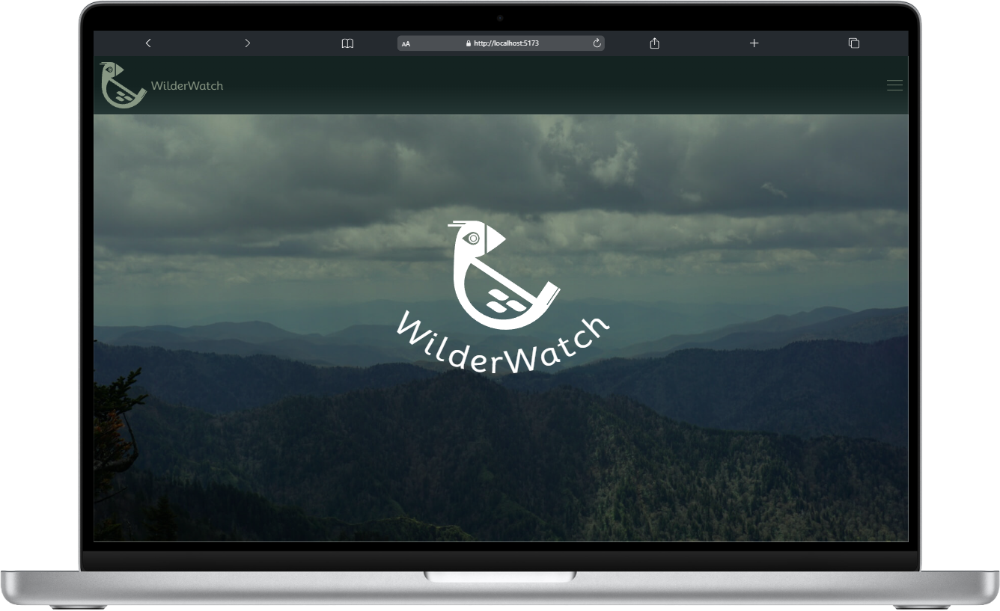

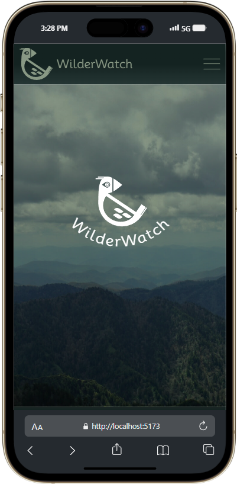

_You are currently viewing the repository for the client side. Click [here](https://github.com/ryanmphill/wilder-watch-server) to view the repository for the Django server._
## Primary Features
Users can:
 - View current active studies
 - Participate in active studies by using their current location or entering in coordinates
 - View all of the observations for a study by interacting with markers on a map
 - Create their own study
 - Update their study information
 - Delete their study
 - View the stats of user activity on user profile pages

 ## View Deployed Project
 _Coming soon!_

 ## Installations and instructions to view on local machine

1.  Pull down client-side repo and install dependencies for React in the wilder-watch-client directory:

    ```bash
    git clone git@github.com:ryanmphill/wilder-watch-client.git
    ```

    ```bash
    npm install
    ```

2.  Next, pull down the [demo repository](https://github.com/ryanmphill/wilder-watch-demo-server) for the Django server. It is identical to the Django server used for production, except that it has a generic "secret key" used for development instead of the real thing.

    ```bash
    git clone git@github.com:ryanmphill/wilder-watch-demo-server.git
    ```
    Then, start up the virtual environment in the root directory of the server

    ```bash
    pipenv shell
    ```

    and install the dependencies

    ```bash
    pipenv install
    ``` 

    To get some dummy data, you can run this executable script:

    ```bash
    ./seed_data.sh
    ```

    Finally, you can get the server running locally on port 8000 with the following command:

    ```bash
    python3 manage.py runserver
    ```

3.  This project uses **Mapbox-GL** and **react-map-gl** to display the geolocation data on a map. If you want to interact with the data via the maps API, you will need to create an account and get an API key from the [Mapbox](https://account.mapbox.com/auth/signup/)
website:

    Once you have the API key, all you need to do is create a .env file in the client and place it at the top.

    In the root directory of wilder-watch-client:

    ```bash
    touch .env
    ```

    Then, go inside of the .env file and paste

    ```
    VITE_MAPBOX_TOKEN = "<API KEY GOES HERE (without the brackets)>"
    ```

4.  Now you can start up the Wilder Watch Client locally on port 5173 by running this command in the wilder-watch-client project directory:

    ```bash
    npm run dev
    ```

5.  You're now ready to browse around WilderWatch! If you aren't an authenticated user, the content of the app is read only, so feel free to register a new user and test it out!

#### Having trouble getting started?
Please reach out to me or open an issue, and I will try to resolve it ASAP.

## Main Feed

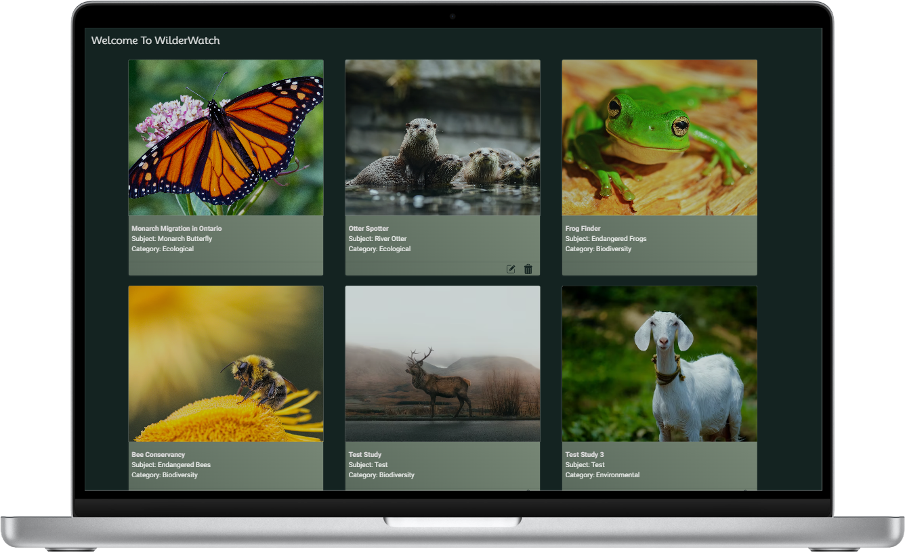

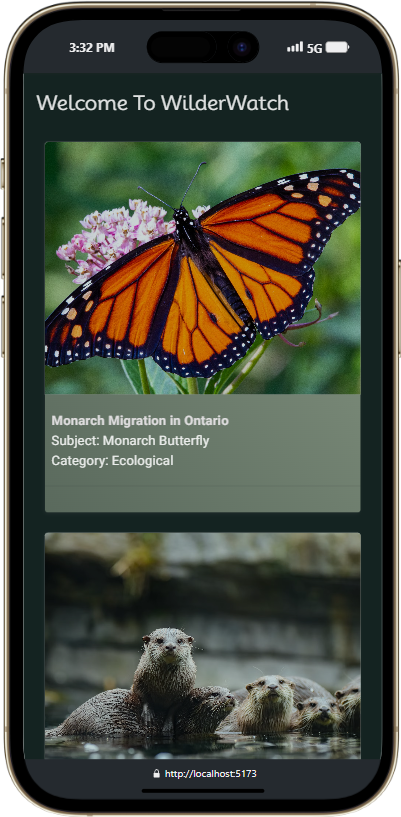

## Study Page

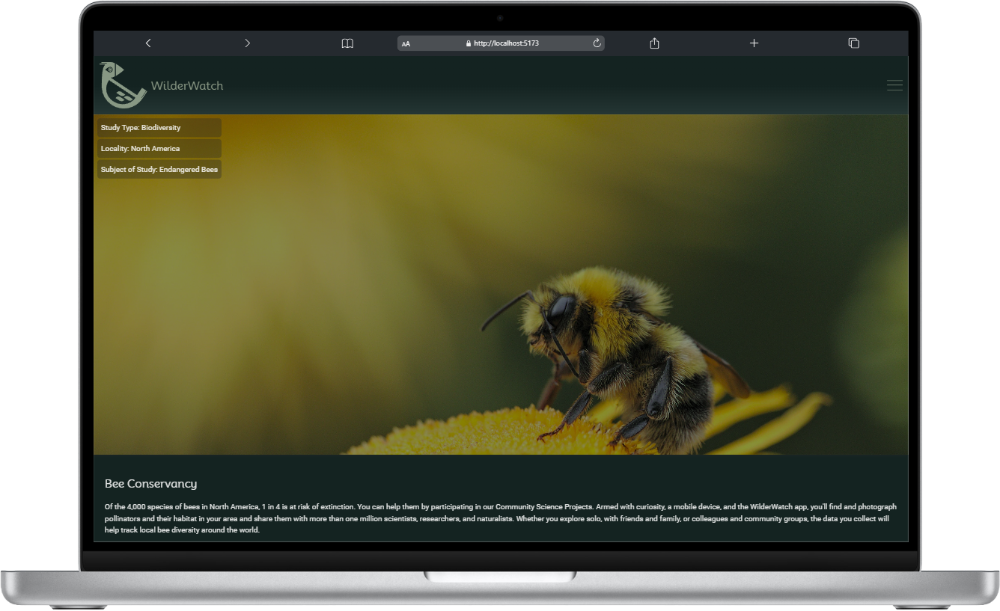
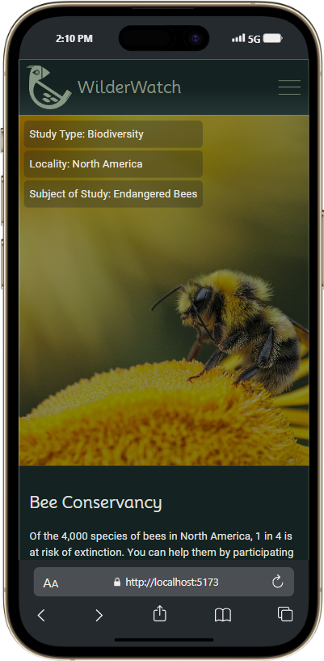

## Map

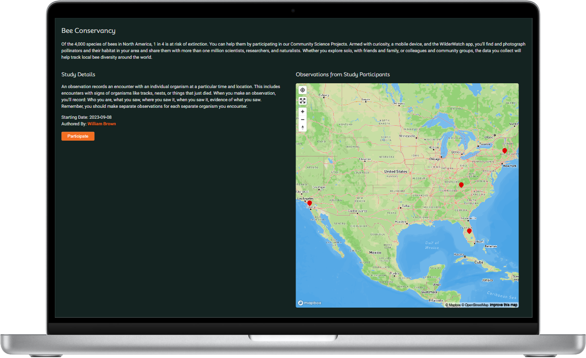
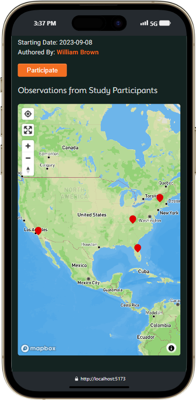

## Profile

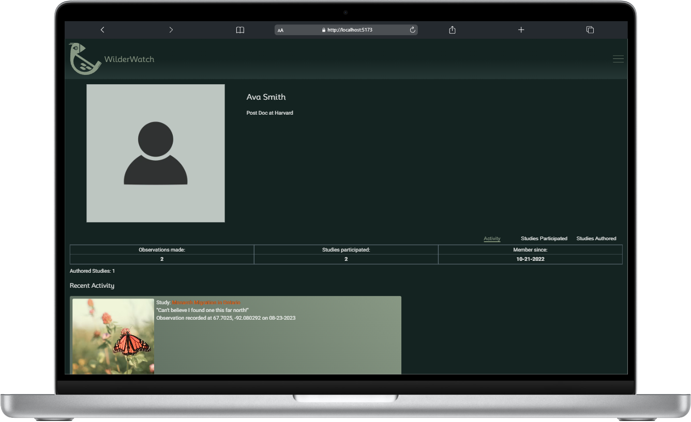
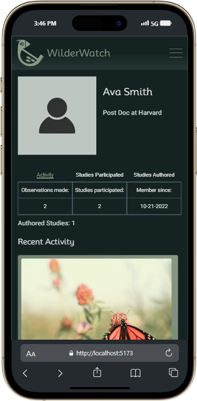

## Forms

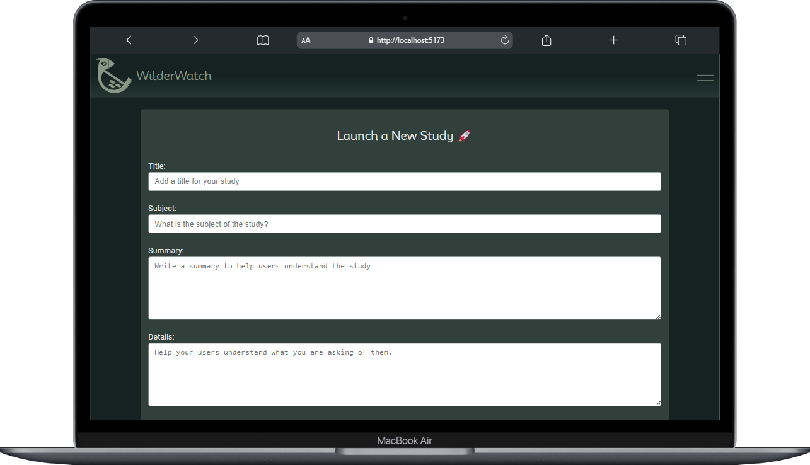
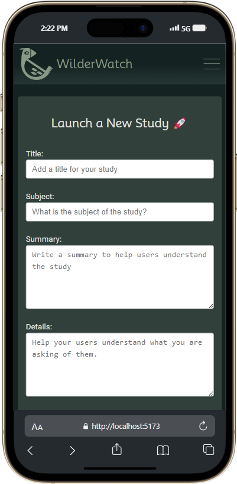
### Recording an observation
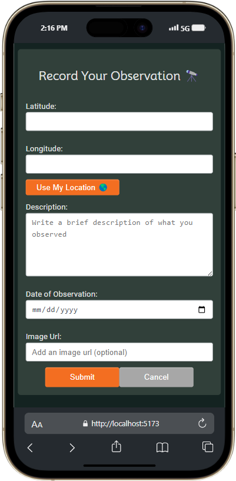
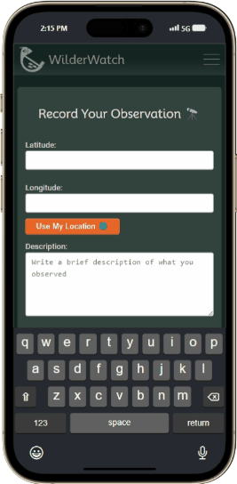

# React + Vite

This template provides a minimal setup to get React working in Vite with HMR and some ESLint rules.

Currently, two official plugins are available:

- [@vitejs/plugin-react](https://github.com/vitejs/vite-plugin-react/blob/main/packages/plugin-react/README.md) uses [Babel](https://babeljs.io/) for Fast Refresh
- [@vitejs/plugin-react-swc](https://github.com/vitejs/vite-plugin-react-swc) uses [SWC](https://swc.rs/) for Fast Refresh
